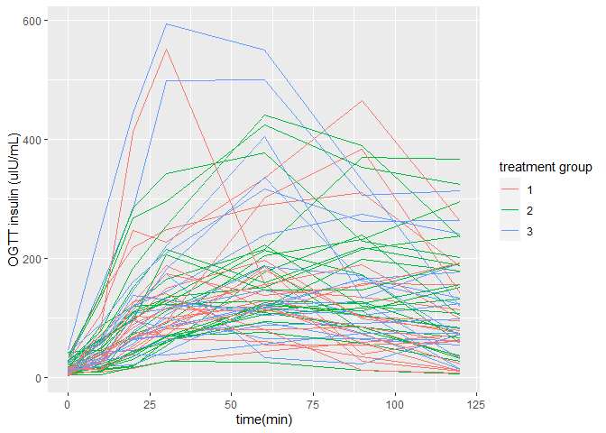

Example of Insulin Curves
================
Kevin Cummiskey
3/18/2022

The following code imports data from the study “Macronutrients and Body
Fat Accumulation: A Mechanistic Feeding Study” publicly available at
<https://osf.io/m6v73/>.

The data files are:

-   fb4\_use.csv

-   fs2\_use.csv

See the website for a data dictionary. The data files contain 37
variables on each subject (demographics, biomarkers, etc.).

### Import the data

``` r
library(tidyverse)
library(knitr)

#import fb4_use.csv and fs2_use.csv
data1 <- read_csv("https://osf.io/rmpnw/download", col_names = TRUE)
data2 <- read_csv("https://osf.io/qcwft/download", col_names = TRUE)

data <- rbind(data1, data2)

names(data)
```

    ##  [1] "studyid"                     "BSL_insulin30"              
    ##  [3] "female"                      "hispanic"                   
    ##  [5] "race"                        "DXA_age"                    
    ##  [7] "wbtot_fat_BSL"               "wbtot_mass_BSL"             
    ##  [9] "wbtot_pure_lean_BSL"         "trunk_fat_BSL"              
    ## [11] "ratio_android_gynoid_BSL"    "pct_fat_BSL"                
    ## [13] "ratio_android_BSL"           "ratio_gynoid_BSL"           
    ## [15] "pct_fat_change"              "pct_change_wbtot_as_fat"    
    ## [17] "pct_trunkfat_wbtot_BSL"      "pct_trunkfat_wbtot_change"  
    ## [19] "ratio_android_gynoid_change" "ratio_android_change"       
    ## [21] "ratio_gynoid_change"         "pct_purelean_BSL"           
    ## [23] "pct_purelean_change"         "wbtot_mass_change"          
    ## [25] "pct_wbtot_mass_change"       "trunkfat_change"            
    ## [27] "wbtot_fat_change"            "wbtot_pure_lean_change"     
    ## [29] "completers"                  "BSL_insulin10"              
    ## [31] "BSL_insulin20"               "BSL_insulin60"              
    ## [33] "BSL_insulin90"               "BSL_insulin120"             
    ## [35] "BSL_insulin_fast"            "BSL_HOMA_IR"

The subjects were randomized to three test diets:

-   Hypocaloric Very-Low-Carbohydrate (VLC)

-   High Carbohydrate-Low Sugar (HC-LS)

-   High Carbohydrate-High Sugar (HC-HS)

``` r
#add subject's treatment group information
subject_info <- read_csv("https://osf.io/3ctnm/download",
                         col_names = TRUE)
subject_info <- subject_info %>% 
  select(randomization, subjectid) %>%
  distinct()
  
data <- data %>% left_join(subject_info,
                           by = c("studyid" = "subjectid"))
#remove subjects not randomized; convert to factor variable
data <- data %>% 
  filter(!is.na(randomization)) %>% 
  mutate(randomization = factor(randomization))
```

### Convert to tidy format for analysis

``` r
#extract just the insulin measurements and convert to long format
data_BSL <- data %>% 
  select(studyid, randomization, starts_with("BSL")) %>% 
  select(-BSL_HOMA_IR) %>% 
  pivot_longer(cols = -c(studyid, randomization), 
               names_to = "time(min)", 
               values_to = "BSL_insulin")

#extract the time of the measurement (minutes)
#convert N/A (baselines) to zero
data_BSL <- data_BSL %>% 
  mutate(`time(min)` = str_extract(`time(min)`,"\\d+")) %>% 
  mutate(`time(min)` = as.integer(`time(min)`)) %>% 
  mutate(`time(min)` = replace_na(`time(min)`, 0)) 

data_BSL %>% 
  head(10) %>% 
  kable(caption = "First 10 rows of the data")
```

| studyid   | randomization | time(min) | BSL\_insulin |
|:----------|:--------------|----------:|-------------:|
| FB-1178-5 | 2             |        30 |        91.31 |
| FB-1178-5 | 2             |        10 |        42.24 |
| FB-1178-5 | 2             |        20 |        72.49 |
| FB-1178-5 | 2             |        60 |       204.00 |
| FB-1178-5 | 2             |        90 |       231.90 |
| FB-1178-5 | 2             |       120 |       296.00 |
| FB-1178-5 | 2             |         0 |        18.63 |
| FC-2291-6 | 1             |        30 |       115.70 |
| FC-2291-6 | 1             |        10 |        27.11 |
| FC-2291-6 | 1             |        20 |        89.07 |

First 10 rows of the data

``` r
#save both wide and long formats
#data_BSL %>% 
#  write_csv("./output/BSL_insulin_long.csv")

#data %>% 
#  write_csv("./output/BSL_insulin_wide.csv")
```

### Plot the insulin curves

``` r
data_BSL %>% 
  ggplot(aes(x = `time(min)`, 
             y = BSL_insulin, 
             group = studyid,
             color = randomization)) +
  labs(y = "OGTT insulin (uIU/mL)",
       color = "treatment group") +
  geom_line()
```

<!-- -->

### Future Work

-   fit models to each curve, extract parameters

-   use parameters in follow-on analyses (for example, are the
    treatments, covariates, or outcomes related to the parameters.)
