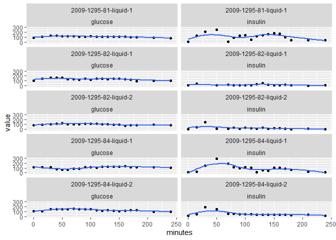

splines\_for\_glucose
================
Kevin Cummiskey
4/22/2022

``` r
# read in the data
library(tidyverse)
library(broom)

curves <- read_csv("./data/BG_curves_data.csv")


curves_long <-  curves %>% 
  select(1:22) %>% 
  pivot_longer(cols = 3:22,
               names_to = "minutes",
               values_to = "value") %>% 
  mutate(minutes = as.integer(minutes))

curves_long %>% 
  ggplot(aes(x = minutes, y = value, group = Participant)) + 
  geom_smooth(se = FALSE) +
  facet_wrap(~type_curve) +
  labs(title = "Glucose and Insulin curves for subjects following a mixed meal tolerance test (n = 198)")
```

<!-- -->

Let’s look at a couple of curves.

``` r
sample <- curves_long %>% 
  select(Participant) %>% 
  distinct() %>% 
  top_n(5) %>% 
  pull(Participant)

curves_long %>% 
  filter(Participant %in% sample) %>% 
  ggplot(aes(x = minutes, y = value)) +
  geom_point() +
  geom_smooth(se = FALSE) +
  facet_wrap(Participant ~ type_curve, ncol = 2)
```

<!-- -->

Try splines on one curve

``` r
patient84 <- curves_long %>% 
  filter(Participant == "2009-1295-84-liquid-2") %>% 
  filter(type_curve == "insulin") %>% 
  filter(!is.na(value))

smooth.spline(patient84$minutes, patient84$value, df =12 ) %>% 
  augment() %>% 
  ggplot(aes(x = x)) + 
  geom_point(aes(y = y)) + 
  geom_line(aes(y = .fitted)) 
```

<!-- -->
